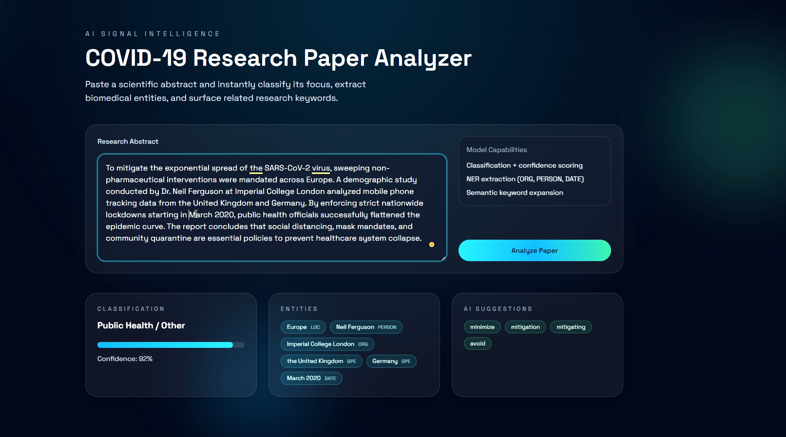
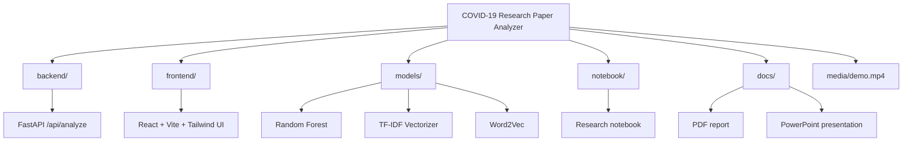

# COVID-19 Research Paper Analyzer

Full-stack web app for classifying COVID-19 paper abstracts, extracting entities, and suggesting related keywords.

## Screenshots
### Results View

> *Classified topic, extracted entities, and related keyword recommendations.*
## Demo Video

If your Markdown viewer supports HTML video, you can preview the demo directly here:

<video controls width="100%" src="media/demo.mp4"></video>

If the embedded player does not render, open [media/demo.mp4](media/demo.mp4) directly.


## Project Structure

```
backend/
  main.py
  requirements.txt
frontend/
  index.html
  package.json
  postcss.config.js
  tailwind.config.js
  vite.config.js
  src/
    App.jsx
    index.css
    main.jsx
models/
  rf_model.joblib
  tfidf_vectorizer.joblib
  word2vec_model.gensim
notebook/
  covid19_projectByAmineHM.ipynb
docs/
  COVID-19 Research Paper Analyzer Report by AmineHM.pdf
  COVID_NLP_Presentation AmineHM.pptx
media/
  demo.mp4
```

## Visual Layout



## Backend (FastAPI)

1. Create and activate a virtual environment.
2. Install dependencies:

```
pip install -r backend/requirements.txt
```

3. Download spaCy model:

```
python -m spacy download en_core_web_sm
```

4. Run the API:

```
python -m uvicorn backend.main:app --reload --port 8000
```

## Frontend (Vite + React + Tailwind)

1. Install dependencies:

```
cd frontend
npm install
```

2. Start the dev server:

```
npm run dev
```

The Vite dev server proxies `/api` to `http://localhost:8000`.

## Notes

- Keep the trained models in `models/` at the project root for local use.
- The demo video is stored at `media/demo.mp4`.
- The report and presentation live in `docs/`.
- The research notebook lives in `notebook/`.
- If you plan to share the repo, store large artifacts in a separate download location (cloud storage or release assets) and document the link here.
- NLTK downloads required data on first startup.
